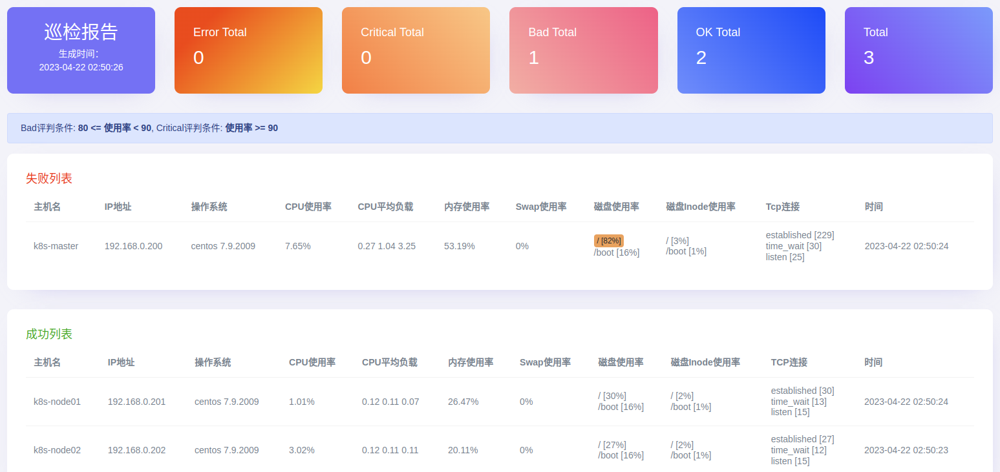

Forked from liushiju/ansible-HealthCheck，并且针对AAP的AC EE容器环境进行了优化配置和修改：

# Ansible Role: os-check

针对linux系统进行资源巡检，生成巡检报告后可以通过邮件发送给接收人

## 要求

此角色仅在linux系统上执行。

## 测试环境

ansible `2.15.0`
os `RHEL 7.9及以上版本`
python `3.9`

## 角色变量
	check_day: "{{ '%Y-%m-%d' | strftime }}"
	# 设置报告存储的目录
	check_report_path: /tmp
	check_report_file_suffix: "-{{ check_day }}"
	
	# 设置smtp账号信息
	check_mail_host: ""
	check_mail_port: ""
	check_mail_username: ""
	check_mail_password: ""
	check_mail_to: []
	check_mail_subject: "System Check Report [{{ check_day }}]"


## 依赖

- 过滤器插件 `filter_plugins/os-check.py [get_check_data]`
- 目标机`bash`

## Github地址


## 执行流程

1. 使用脚本`files\check_linux.sh`在远端执行获取资源数据，并以json结构体返回。
2. 使用`jinja2`模板将获取的数据渲染到模板文件中`templates\report-cssinline.html`,生成的文件存放在指定的目录中。
	- `report-cssinline.html` 是将css设置以`inline`的方式存储的html文件,`report.html`才是源模板文件，修改完源模板文件后，使用[Responsive Email CSS Inliner](https://htmlemail.io/inline/)进行转换下，才能更好的兼容邮件显示。
	- 其中模板中使用的`get_check_data`过滤器是从`hostvars`中获取每台主机的脚本执行结果，进行分析整理传递给模板，使用传递回来的数据进行渲染。
3. 获取生成的模板文件内容，并通过smtp发送给接收人。

### 统计的系统资源

- 主机名
- IP地址
- 操作系统
- CPU使用率
- CPU平均负载
- 内存使用率
- Swap使用率
- 磁盘使用率
- 磁盘Inode使用率
- Tcp连接
- 时间

### 执行巡检

- 生成报告

```bash
# ansible-playbook roles/os-check.yaml
PLAY [k8s] **********************************************************************************

TASK [os-check : Get system check data.] ****************************************************
changed: [192.168.0.200]
changed: [192.168.0.202]
changed: [192.168.0.201]

TASK [os-check : Generate report file.] *****************************************************
changed: [192.168.0.200]

TASK [os-check : Get report file content.] **************************************************
ok: [192.168.0.200]

TASK [os-check : Send a report by email.] ***************************************************
skipping: [192.168.0.200]

PLAY RECAP **********************************************************************************
192.168.0.200              : ok=3    changed=2    unreachable=0    failed=0    skipped=1    rescued=0    ignored=0   
192.168.0.201              : ok=1    changed=1    unreachable=0    failed=0    skipped=0    rescued=0    ignored=0   
192.168.0.202              : ok=1    changed=1    unreachable=0    failed=0    skipped=0    rescued=0    ignored=0
```

- 查看报告

```bash
cd /tmp
report-2023-04-22.html

# 通过浏览器打开查看
python -m SimpleHTTPServer 80
```

- 网页查看



### 在Ansible Automation Platform 中的 Automation Controller 上执行时，需要额外封装容器镜像，并且针对RHEL7进行配置优化：

[root@controller safety-patrol]# more ansible.cfg
[defaults]
inventory = ./inventory
filter_plugins = filter_plugins

[galaxy]
server_list = automation_hub, galaxy


[galaxy_server.automation_hub]
url=https://console.redhat.com/api/automation-hub/
username=fzhang@xxxt.com
password=Foxxxx


[galaxy_server.galaxy]
url=https://galaxy.ansible.com/
token=a277c58d2xxxb6d01a90e4f6

[root@controller safety-patrol]# more requirements.yml
---
collections:
  - community.general

[root@controller safety-patrol]# more execution-environment.yml
---
version: 1

build_arg_defaults:
  EE_BASE_IMAGE: registry.redhat.io/ansible-automation-platform-24/ee-minimal-rhel8:latest
  EE_BUILDER_IMAGE: registry.redhat.io/ansible-automation-platform-24/ansible-builder-rhel8:latest

ansible_config: ansible.cfg

dependencies:
  galaxy: requirements.yml

additional_build_steps:
  append:
  - RUN microdnf install -y glibc-langpack-en; sed -i 's/^LANG=.*/LANG="en_US.utf8"/' /etc/locale.conf; sed -i 's/^LC_ALL=.*/LC_ALL="en_US.utf8"/' /etc/locale.conf
  - ENV LANG=en_US.utf8
  - ENV LC_CTYPE=en_US.utf8
  - ENV LC_ALL=en_US.utf8

[root@controller safety-patrol]# podman login --log-level debug registry.redhat.io

[root@controller safety-patrol]#  ansible-builder create -v 3

[root@controller safety-patrol]#  podman build -f context/Containerfile context --no-cache -t localhost/demo_ee:latest-1

[root@controller safety-patrol]#  podman login --log-level debug hub.example.com

[root@controller safety-patrol]# podman tag localhost/demo_ee:latest-1 hub.example.com/demo_ee:latest-1

[root@controller safety-patrol]# podman push hub.example.com/demo_ee:latest-1


